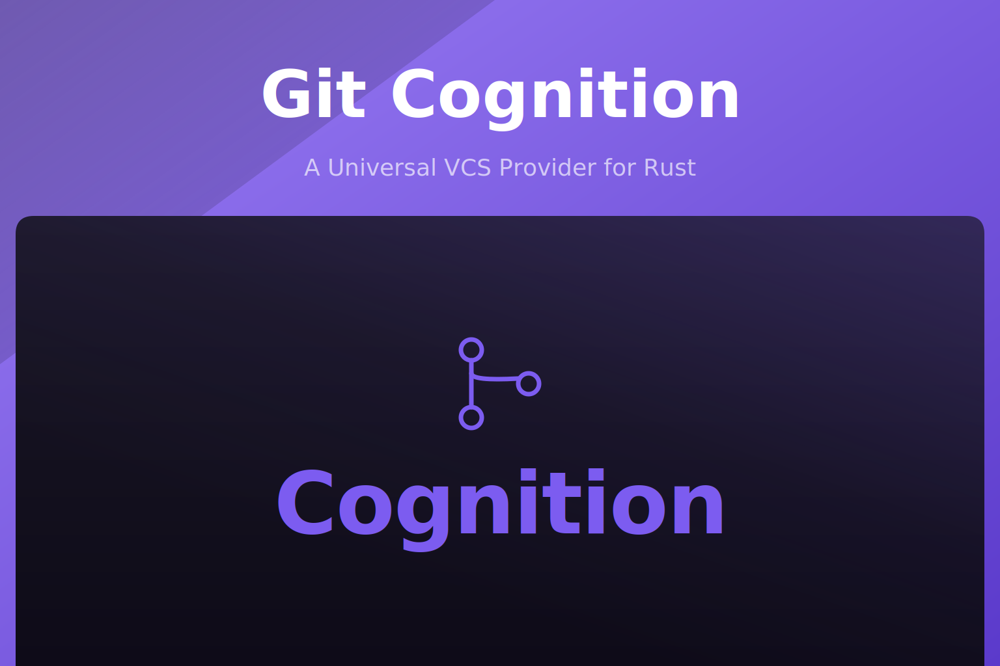

<p align="center">
  
</p>

<p align="center">
  <a href="https://crates.io/crates/git-cognition"></a>
  <a href="https://crates.io/crates/git-cognition"></a>
  <a href="https://docs.rs/git-cognition"></a>
  <a href="https://github.com/akira-io/git-cognition-rs/actions/workflows/test.yml"></a>
  
  
</p>

`git-cognition` is a universal VCS provider abstraction for Rust with a local Git read surface in
the same crate. GitHub, GitLab, and Bitbucket ship as driver modules behind feature flags; local
Git operations (log, diff, blame, merge preview, worktree, status) work without any feature.

## Install

CLI:

```sh
# Default: GitHub provider + local Git plane
cargo add git-cognition

# GitLab only
cargo add git-cognition --no-default-features --features gitlab

# All providers
cargo add git-cognition --features all

# Local Git plane only, no remote provider
cargo add git-cognition --no-default-features
```

By hand in `Cargo.toml`:

```toml
git-cognition = "0.1"
git-cognition = { version = "0.1", default-features = false, features = ["gitlab"] }
git-cognition = { version = "0.1", features = ["all"] }
git-cognition = { version = "0.1", default-features = false }
```

## Documentation

Full documentation lives in this repository under `docs/`:

- Overview: [docs/00-overview.md](docs/00-overview.md)
- Architecture: [docs/01-architecture.md](docs/01-architecture.md)
- Development: [docs/02-development.md](docs/02-development.md)
- Authentication: [docs/03-auth.md](docs/03-auth.md)
- Transport: [docs/04-transport.md](docs/04-transport.md)
- Middleware: [docs/05-middleware.md](docs/05-middleware.md)
- Rate limit: [docs/06-rate-limit.md](docs/06-rate-limit.md)
- Telemetry: [docs/07-telemetry.md](docs/07-telemetry.md)
- Pagination: [docs/08-pagination.md](docs/08-pagination.md)
- Errors: [docs/09-errors.md](docs/09-errors.md)
- Provider runtime: [docs/10-provider-runtime.md](docs/10-provider-runtime.md)
- Repo requests: [docs/11-repo-requests.md](docs/11-repo-requests.md)
- Provider contracts: [docs/12-provider-contracts.md](docs/12-provider-contracts.md)
- Issue requests: [docs/13-issue-requests.md](docs/13-issue-requests.md)
- Code review requests: [docs/14-code-review-requests.md](docs/14-code-review-requests.md)
- Release requests: [docs/15-release-requests.md](docs/15-release-requests.md)
- Provider manager facade: [docs/20-provider-manager-facade.md](docs/20-provider-manager-facade.md)
- Provider conformance suite: [docs/21-provider-conformance-suite.md](docs/21-provider-conformance-suite.md)
- End-to-end usage: [docs/22-end-to-end-usage.md](docs/22-end-to-end-usage.md)
- Local Git read surface: [docs/24-local-git-cognition-reads.md](docs/24-local-git-cognition-reads.md)
- API reference on docs.rs: https://docs.rs/git-cognition

## Local Git Requirement

Local cognition APIs shell out to `git`. Merge preview requires Git 2.38 or newer because it uses
`git merge-tree --write-tree`. Use Git 2.50.1 or newer in CI and development to match the tested
environment.

## Testing

```sh
cargo test --all-features
```

## Changelog

Please see [CHANGELOG.md](CHANGELOG.md) for what has changed recently. The changelog is generated
from conventional commits via [git-cliff](https://git-cliff.org) on every release tag.

## Contributing

Please see [CONTRIBUTING.md](CONTRIBUTING.md) for details.

## Security Vulnerabilities

Please review [our security policy](SECURITY.md) on how to report security vulnerabilities.

## Credits

- [kid](https://github.com/kidiatoliny)
- [All Contributors](https://github.com/akira-io/git-cognition-rs/graphs/contributors)

## License

Dual-licensed under either of the following, at your option:

- MIT License ([LICENSE-MIT](LICENSE-MIT) or https://opensource.org/licenses/MIT)
- Apache License 2.0 ([LICENSE-APACHE](LICENSE-APACHE) or https://www.apache.org/licenses/LICENSE-2.0)

Unless you explicitly state otherwise, any contribution intentionally submitted for inclusion in
this crate by you, as defined in the Apache-2.0 license, shall be dual-licensed as above, without
any additional terms or conditions.
